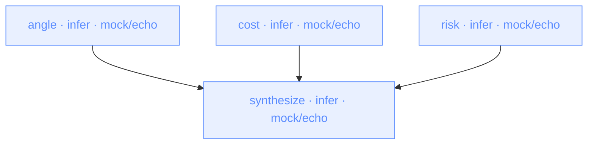

<p align="center">
  <a href="https://nika.sh">
    <picture>
      <source media="(prefers-color-scheme: dark)" srcset="https://nika.sh/brand/nika-logo-dark.svg">
      
    </picture>
  </a>
</p>

<h1 align="center">Nika · the workflow language for AI</h1>

<p align="center"><strong>A declarative YAML language for orchestrating AI workflows.<br>
Sovereign · multi-provider · local-first.</strong></p>

> **Status** · v0.1.0-draft (working) · **License** · Apache-2.0 ·
> [](https://scorecard.dev/viewer/?uri=github.com/supernovae-st/nika-spec)
> [](https://github.com/supernovae-st/nika-spec/actions/workflows/reuse.yml)
>
> The language is locked at `nika: v1`, forever. That's the envelope you
> write in every workflow file; it evolves additively and never breaks (the
> SQL / Dockerfile contract model). The reference engine versions separately.

---

## What is Nika?

Nika is a **language**. Not a framework, not a runtime, not a SaaS.

The language describes the **what** of an AI workflow ·
- which LLMs to call (`infer:`)
- which commands to run (`exec:`)
- which tools to invoke (`invoke:`)
- which agentic loops to spawn (`agent:`)

The **how** lives in conformant engines. The reference implementation
is at [supernovae-st/nika](https://github.com/supernovae-st/nika)
(Rust · AGPL-3.0-or-later).

**Analogies** ·
- `SQL` is to PostgreSQL what `Nika` is to its reference engine
- `Dockerfile` is to Docker what `Nika YAML` is to a workflow runtime
- `GitHub Actions YAML` is to GitHub Actions what `Nika YAML` is to its engine

---

## Hello world

```yaml
nika: v1
workflow:
  id: hello

model: ollama/qwen3.5:4b   # local · zero key · swap for any provider in the catalog

tasks:
  greet:
    infer:
      prompt: "Say hello in French"
```

Run it: install to first output in under a minute ·

```bash
brew install supernovae-st/tap/nika     # single static binary (Rust · no runtime deps)
ollama pull qwen3.5:4b                 # the local model above (once · or swap for a cloud provider)
nika run hello.nika.yaml
```

**New to Nika?** → [**QUICKSTART.md**](./QUICKSTART.md) builds a real workflow in 5 minutes.

---

## The DAG, drawn by nika itself

This diagram is generated by `nika inspect examples/02-parallel-fanout.nika.yaml --format mermaid` · [the example](./examples/02-parallel-fanout.nika.yaml), not drawn by hand (each verb carries its canonical color). Three angles fan in to one synthesis:



Run `nika inspect <file> --format mermaid` on any workflow and paste the output; it renders on GitHub as-is.

---

## The 5 pillars · immutable forever

1. **Envelope**: one line · `nika: v1` + `workflow:` header (+ typed `inputs` · `config` · `const` · `secrets`)
2. **The 4 verbs**: `infer:` (LLM) · `exec:` (shell) · `invoke:` (tools/MCP) · `agent:` (autonomous loop)
3. **DAG shape**: tasks + `with:` data edges + `after:` control + `when` + `for_each`
4. **Variables**: one `${{ ... }}` syntax · <!-- canon:namespaces -->6<!-- /canon --> namespaces (`inputs` · `config` · `const` · `secrets` · `with` · `tasks`)
5. **Error model**: `NIKA-<NS>-<NNN>` codes · retry semantics · structured output

These 5 things never change. Everything else (providers · builtins ·
extract modes · etc.) lives in the **stdlib** and evolves separately.

See [spec/](./spec/) for the full specification.

---

## Repository layout

```
nika-spec/
├── spec/                      ← THE specification (~30 pages markdown)
│   ├── 00-overview.md           one-page vision
│   ├── 01-envelope.md           nika: v1 + workflow + typed inputs/config/const/secrets
│   ├── 02-verbs.md              the 4 verbs · signatures + semantics
│   ├── 03-dag.md                tasks · with/after edges · when · for_each
│   ├── 04-variables.md          ${{ }} · 6 namespaces · inputs/config/const/secrets/with/tasks
│   ├── 05-errors.md             error codes · retry · structured output
│   ├── 06-stdlib-contract.md    how the stdlib versions independently
│   ├── 07-conformance.md        what « v0.1-compliant » means
│   └── 08-out-of-scope.md       explicit defer list (memory · macros · etc.)
│
├── schemas/                   ← machine-readable JSON Schemas
├── examples/                  ← foundation + showcase workflows (the versioned pack)
├── templates/                 ← instantiable skeletons · the agent authoring path
├── conformance/               ← test suite for any implementation (3 static tiers)
├── eval/                      ← the agent-authoring benchmark (protocol vs routing vs freeform)
├── scripts/                   ← projectors (docs · website · pack stay byte-derived)
├── canon/                     ← the SSOT registries (laws · diagnostics · surface)
├── canon.yaml                 ← machine-readable counts · GENERATED from canon/ since C0
├── GLOSSARY.md                ← one word, one meaning (the disambiguation surface)
├── CONTRIBUTING.md            ← the two doors (NEP for normative · PR for the rest)
├── AGENTS.md                  ← the deterministic authoring protocol (agents start here)
│
├── stdlib/                    ← versioned independently
│   ├── providers-v0.1.md        the canonical providers (ollama · llamacpp · vllm · mistral · …)
│   ├── extract-modes-v0.1.md    the fetch extract modes (markdown · article · jq · …)
│   └── builtins-v0.1.md         the curated builtins (counts live in canon.yaml)
│
├── governance/                ← how the standard evolves (NEP-0000 · certifications matrix)
└── registry/                  ← the sharing contract (versioned independently)
    └── registry-v0.1.md         entries · trust model · advisories · machine surfaces
```

---

## For implementers

If you want to implement Nika in your language ·

0. Skim [`GLOSSARY.md`](./GLOSSARY.md) — one word, one meaning (oracle · gate · golden · predicate-vs-status)
1. Read [`spec/`](./spec/) (the contract · 17 chapters)
2. Run the suite per the [runner protocol](./conformance/runner-protocol.md) — declarative fixtures (`input.yaml` + `expected.json`), needing only a YAML+JSON parser to understand · `pip install -r conformance/requirements.txt && python3 conformance/runner.py all` exercises the reference oracle
3. Pass it — the claim is « **Nika v1 Conformant — <Level> (spec <commit>)** » · one form (spec/07 §Claiming) · earned by the suite, never by declaration
4. Optionally implement the [`stdlib/`](./stdlib/) (providers + extract + builtins)
5. Open a PR adding your row to [`CONFORMANT_IMPLEMENTATIONS.md`](./CONFORMANT_IMPLEMENTATIONS.md) — the registry (pinned spec commit + reproducible command)

**License**: this spec is **Apache-2.0** with patent grant. Use it freely.

---

## Reference implementation

[supernovae-st/nika](https://github.com/supernovae-st/nika) · the reference engine · Rust · AGPL-3.0-or-later.

The reference engine is installable and runs workflows end-to-end today ·
`brew install supernovae-st/tap/nika` · then `nika check` + `nika run` ·
- Targets full v0.1 spec conformance (Stdlib level)
- Self-contained single binary (embeds this spec + schema + examples ·
  `nika spec` / `nika schema` / `nika examples` work offline;
  `cargo install nika` joins brew + curl as an install path at 1.0)
- Exposes the engine's static oracle via MCP server (`nika mcp`) for harness
  integration (Claude Code · Cursor · Hermes · etc.). The MCP surface is
  read-only, <!-- canon:mcp_tools -->9<!-- /canon --> tools (`nika_check` · `nika_inspect` · `nika_explain` ·
  `nika_schema` · `nika_examples` · `nika_template` · `nika_canon` ·
  `nika_catalog` · `nika_tools`); execution stays behind `nika run`.
- Engine-free alternative · the [conformance oracle](./conformance/) in this
  repo validates any workflow statically
  (`python3 conformance/runner.py validate <file>`)

---

## Why a language?

Today every AI harness reinvents workflows · Python files · TS classes ·
prompts inline · DAGs imperative · skills crystallized into their own
runtime. **None of them are portable.**

A portable language means ·
- One YAML workflow · runs on any conformant engine (Rust · Python · Go · …)
- Read · share · review · diff like any other text
- The **language is the contract** · the runtime is implementation

Standards work · SQL · GraphQL · OpenAPI · Dockerfile · GitHub Actions YAML.
Nika is that for AI workflows.

### Why not … ?

| Instead of | The one-line difference |
|---|---|
| **GitHub Actions / Argo** | CI YAML orchestrates *repos and runners*; Nika's four verbs are *AI-native* (`infer` is a first-class primitive with providers, budgets, structured output, not a shell step calling curl). |
| **Temporal / Inngest / Restate** | Those are durable-execution *runtimes* for long-lived distributed state; Nika is a finite single-run DAG *language*, no clusters, no event history, one file in, one run out. |
| **LangGraph / framework code** | A Python/TS graph is code locked to its framework and runtime; a Nika file is portable text: any conformant engine runs it, and there is deliberately no importer/exporter chaining the language to others' semantics. |
| **Prompting an agent directly** | A workflow is reviewable, diffable, re-runnable and statically checkable (`nika check` catches errors before any token is spent); a chat transcript is none of those. |

The full boundary rationale (including proud non-goals) lives in
[spec/08-out-of-scope.md](./spec/08-out-of-scope.md).

---

## The examples pack (versioned · embedded in the binary)

**Every spec version ships its pack.** [`examples/manifest.yaml`](examples/manifest.yaml)
(generated · `pack_version` = the [`VERSION`](VERSION) file) lists every
canonical workflow (foundation + showcase) with tier, constructs and a
sha256 over the exact text every surface renders. The contract:

- the **docs** and the **website** render projections of these files (never copies)
- the **reference engine embeds the pack of its version**: `nika examples`
  / `nika spec` / `nika schema` work offline, and an installed binary always
  carries the canonical examples *of the language version it speaks*
- the manifest hashes make the pack **verifiable end-to-end**: a tampered or
  drifted example fails the check, anywhere it travels

## Tooling (deterministic mesh)

| Tool | Role |
|---|---|
| [`canon.yaml`](canon.yaml) | THE source for every language count (verbs · namespaces · builtins · providers · modes · error namespaces) |
| [`scripts/canon-projectors.py`](scripts/canon-projectors.py) | projects canon counts → docs snippet + website module (`--write` / `--check`) |
| [`scripts/showcase-projector.py`](scripts/showcase-projector.py) | projects [`examples/showcase/`](examples/showcase/) → docs example pages + website explorer (yaml · diagrams · run-sim model · coverage matrix) |
| [`conformance/runner.py`](conformance/runner.py) | the static oracle · core + stdlib fixtures + every example as a conformance input (the CI gate) |
| [`.pre-commit-hooks.yaml`](.pre-commit-hooks.yaml) | pre-commit hook ids for downstream engines consuming this spec |

Prose counts carry `<!-- canon:X -->N<!-- /canon -->` markers, machine-updatable
(the monorepo `canon-fix` gate rewrites them when canon.yaml moves · drift is a
CI failure, not a maybe).

## Status

- v0.1.0-draft · spec drafted · 7 foundation + 26 showcase examples + 10 templates · workflow.schema.json · 83 static conformance fixtures across three tiers (core · deep · stdlib surface; `python3 conformance/runner.py all` is the live count), every example gated in CI · runtime/behavioral conformance pending
- v0.1.0 GA · target August 2026 (after spec review + examples +
  conformance suite + schemas)

Forever after GA · the 5 pillars are locked. Stdlib evolves independently.

---

## Governance

- **Editor** · SuperNovae Studio (Thibaut Melen + Nicolas)
- **Evolution** · every change to the standard goes through a **NEP**
  (Nika Enhancement Proposal) · start at
  [governance/NEP-0000](./governance/nep-0000-the-nep-process.md) ·
  propose via [the template](./governance/nep-template.md)
- **Discussion** · the NEP's pull request (public · no private track)
- **Decisions** · accepted AND rejected NEPs stay published in
  [governance/](./governance/) · summaries in CHANGELOG.md
- **Committee transfer** · when 3-5 independent conformant runtimes
  exist, authority moves to a joint committee · by NEP, through the
  same door

---

## Related

- **Every door in one page**: install paths, IDEs, agents, skills, MCP, CI, SDKs: [docs.nika.sh/integrations/everywhere](https://docs.nika.sh/integrations/everywhere)
- [supernovae-st/nika](https://github.com/supernovae-st/nika) · reference engine (Rust · AGPL-3.0-or-later)
- [docs.nika.sh](https://docs.nika.sh) · end-user docs · goes live with the launch (source · [supernovae-st/nika-docs](https://github.com/supernovae-st/nika-docs))
- [supernovae-st/nika-client](https://github.com/supernovae-st/nika-client) · TypeScript SDK
- [nika.sh](https://nika.sh) · landing · goes live with the launch

---

## License

This spec · its examples · its conformance tests · its JSON schemas are
all licensed **Apache-2.0** with patent grant. See [LICENSE](./LICENSE).

The reference implementation (separate repo) is AGPL-3.0-or-later.

---

🦋 *Quality over speed · less but better · Rams principle 10.*

---

<p align="center">
  <sub>Docs: <a href="https://docs.nika.sh">docs.nika.sh</a> · Engine (AGPL-3.0): <a href="https://github.com/supernovae-st/nika">nika</a> · Templates: <a href="https://github.com/supernovae-st/nika-starter">nika-starter</a> · <a href="https://github.com/supernovae-st/nika-actions-starter">nika-actions-starter</a> · Registry: <a href="https://github.com/supernovae-st/nika-registry">nika-registry</a></sub>
</p>
