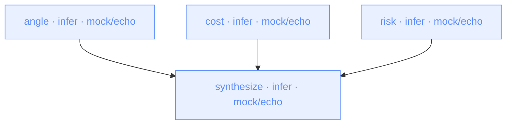

<p align="center">
  <a href="https://nika.sh">
    <picture>
      <source media="(prefers-color-scheme: dark)" srcset="https://nika.sh/brand/nika-logo-dark.svg">
      
    </picture>
  </a>
</p>

<h1 align="center">supernovae-st/nika-spec</h1>

<p align="center">
  <strong>The law of the Nika workflow language: the envelope, the four verbs, the builtins, the providers, the error codes, and the suite that proves an engine speaks it.</strong><br>
  Apache-2.0 · runtime-agnostic · <code>canon.yaml</code> is the single source of every count.
</p>

<p align="center">
  <a href="VERSION"></a>
  <a href="https://github.com/supernovae-st/nika-spec/actions/workflows/conformance.yml"></a>
  <a href="https://github.com/supernovae-st/nika/releases/latest"></a>
  <a href="https://docs.nika.sh"></a>
</p>

<p align="center">
  <a href="https://scorecard.dev/viewer/?uri=github.com/supernovae-st/nika-spec"></a>
  <a href="https://github.com/supernovae-st/nika-spec/actions/workflows/codeql.yml"></a>
  <a href="https://github.com/supernovae-st/nika-spec/actions/workflows/reuse.yml"></a>
  <a href="https://archive.softwareheritage.org/browse/origin/?origin_url=https://github.com/supernovae-st/nika-spec"></a>
  <a href="LICENSE"></a>
</p>

## Thirty seconds, no engine required

The law is text you can read and a suite you can run. Clone it and list the
sections of the one file every count comes from:

```sh
git clone https://github.com/supernovae-st/nika-spec && cd nika-spec
grep -E '^[a-z_]+:' canon.yaml
```

```
schema_version: 1
counts:
outcome_transitions:
verbs:
namespaces:
builtins:
providers:
extract_modes:
templates:
error_namespaces:
error_categories:
error_codes:
pillars:
lifecycle_product:
lifecycle_decision:
lifecycle_risk:
diamond_layers:
steal_pattern_tiers:
severity:
mcp:
canonical_phrasing:
```

Every counted section carries a `count:` that is self-checked against its
`items[]`; prose never types a number, it projects one through a
`<!-- canon:… -->` marker that CI refuses when it drifts. The verbs are the
first immutable section:

```sh
grep -A8 '^verbs:' canon.yaml
```

```
verbs:
  count: 4
  immutable: true
  reference: spec/02-verbs.md
  items:
    - { name: infer,  semantic: "LLM generation · structured output · vision · thinking" }
    - { name: exec,   semantic: "Shell command · blocklist · streaming" }
    - { name: invoke, semantic: "MCP tool call OR builtin (incl. nika:fetch)" }
    - { name: agent,  semantic: "Multi-turn agentic loop · tool calling · guardrails" }
```

Now write the smallest complete workflow, `hello.nika.yaml`. Four answers and
nothing else: what it runs on, what it may touch, what it does, what it hands
back.

```yaml
nika: hello                 # the mark AND the file's name · kebab-case · no version

model: ollama/qwen3.5:4b    # local · zero key · swap for any provider in the catalog

permits: {}                 # the declared zero · this workflow may touch nothing

tasks:
  greet:
    infer:
      prompt: "Say hello in French, in one short sentence."
      max_tokens: 2048

outputs:
  greeting: ${{ tasks.greet.output }}
```

Judge it against the law with no engine at all. The oracle in this repository
is the one CI runs on every fixture, example and template:

```sh
pip install -r conformance/requirements.txt
python3 conformance/runner.py validate hello.nika.yaml
```

```
{
  "valid": true,
  "errors": []
}
```

With the reference engine installed (`brew install supernovae-st/tap/nika`),
the same file is audited before anything runs. `--model mock/echo` rehearses
with no key and no network; these are the last six lines of the card:

```sh
nika --version
nika check hello.nika.yaml --model mock/echo
```

```
nika 0.118.7 (f3a31a6ee)
```

```
 ✔ ORDER    no exec: sits downstream of a net-effecting task · unauthored content never reaches a shell
 ✔ PERMITS  literal + const: args fit the boundary · computed paths + symlinks are the RUN's verdict
 ✔ TRIFECTA no lethal trifecta over the declared permits: without a human gate
 ✔ JOURNEY internal · 0 sources · 0 destinations · 1 model endpoint · no secret reaches an external destination
 ✔ audited · 1 task · 1 wave · permits {} · est out ≤$0.0000 · 0 hints · risk low
 layers · valid ✔ · access ready ✔ · capacity fit ✔ · run ready ✔
```

Run the suite. This is the gate CI runs on every push: the core, stdlib and
deep fixtures, the three value-authority lanes, then every example, snippet
and template as a conformance input (unfiltered, the same command prints one
`PASS` line per fixture and exits 0):

```sh
python3 conformance/runner.py all | grep -E '^(==|Summary)'
```

```
== tests/core ==
Summary · 153/153 passed
== tests/stdlib (static surface) ==
Summary · 54/54 passed
== tests/deep (CEL parse · jq compile · durations · schema-meta) ==
Summary · 38/38 passed
== values (the three-authority family · E-split) ==
Summary · 10/10 passed
== types (io-declaration predicate vocabulary) ==
Summary · 4/4 passed
== gates (after: predicate vocabulary · R5) ==
Summary · 3/3 passed
== examples (each example = a conformance input) ==
== examples/snippets (the website's registered yamls · same gate) ==
== templates (instantiable skeletons · must stay valid) ==
```

**New to Nika?** [QUICKSTART.md](./QUICKSTART.md) builds a real workflow in
five minutes.

## Why this building

- **The prose is normative on conflict.** The published JSON Schema and the
  reference engine follow the spec; for the error codes, the spec table · not
  any engine's source code · owns the taxonomy. When an engine disagrees, the
  corpus keeps the case, marks it `DIVERGENCE`, and reports it: visible
  pressure, never a silent green.
- **Counts are never typed.** Verbs, namespaces, builtins, providers, extract
  modes, templates and error namespaces live in [`canon.yaml`](canon.yaml),
  generated from the law tables under [`canon/`](canon/); every prose count is
  a marker that `scripts/canon-projectors.py --check` rewrites or refuses.
- **Audited before it runs.** Every corpus file declares its intent in a
  `# Expected:` header. The negative half is refused with the exact code the
  header names, the lethal trifecta included, before any token is spent.
- **Pinned, never floating.** The engine, the VS Code extension and the
  registry each carry a `SPEC_PIN`; the engine vendors this pack byte for byte
  at that pin and its build refuses a mismatch. See
  [how the city pins the law](#how-the-city-pins-the-law).

## What is Nika?

Nika is a **language**. Not a framework, not a runtime, not a SaaS.

The language describes the **what** of an AI workflow ·
- which LLMs to call (`infer:`)
- which commands to run (`exec:`)
- which tools to invoke (`invoke:`)
- which agentic loops to spawn (`agent:`)

The **how** lives in conformant engines. The reference implementation is
[supernovae-st/nika](https://github.com/supernovae-st/nika) (Rust ·
AGPL-3.0-or-later).

**Analogies** ·
- `SQL` is to PostgreSQL what `Nika` is to its reference engine
- `Dockerfile` is to Docker what `Nika YAML` is to a workflow runtime
- `GitHub Actions YAML` is to GitHub Actions what `Nika YAML` is to its engine

The language is locked at **v1**, forever: there is no `nika: v2`, ever. What
you write is `nika: <name>`: the key is the mark that says « this is a nika
file » AND the file's own name. Pre-1.0 breaking changes live inside v1; after
engine 1.0.0 the family evolves additively and never breaks (the SQL and
Dockerfile contract model). The reference engine versions separately.

## The DAG, drawn by nika itself

This diagram is generated by `nika inspect examples/02-parallel-fanout.nika.yaml --format mermaid`
([the example](./examples/02-parallel-fanout.nika.yaml)), not drawn by hand;
each verb carries its canonical color. Three angles fan in to one synthesis:


```mermaid
graph TD
  angle["angle · infer · mock/echo"]:::infer
  cost["cost · infer · mock/echo"]:::infer
  risk["risk · infer · mock/echo"]:::infer
  synthesize["synthesize · infer · mock/echo"]:::infer
  angle --> synthesize
  cost --> synthesize
  risk --> synthesize
  classDef infer fill:#5b8cff22,stroke:#5b8cff,color:#5b8cff
```

Run `nika inspect <file> --format mermaid` on any workflow and paste the
output; it renders on GitHub as is.

## The <!-- canon:pillars -->5<!-- /canon --> pillars · immutable forever

1. **Envelope**: one line · `nika: <name>` (the mark AND the name) + the 9 keys (`nika` · `model` · `inputs` · `const` · `secrets` · `permits` · `run` · `tasks` · `outputs`)
2. **The <!-- canon:verbs -->4<!-- /canon --> verbs**: `infer:` (LLM) · `exec:` (shell) · `invoke:` (tools, builtins, MCP, child workflows) · `agent:` (governed loop)
3. **DAG shape**: tasks + `with:` data edges + `after:` control + `when` + `for_each`
4. **Variables**: one `${{ ... }}` syntax · <!-- canon:namespaces -->5<!-- /canon --> namespaces (`inputs` · `const` · `secrets` · `with` · `tasks`)
5. **Error model**: `NIKA-<NS>-<NNN>` codes · retry semantics · structured output

These five things never change. Everything else (providers · builtins ·
extract modes · templates) lives in the **stdlib** and evolves separately.

See [spec/](./spec/) for the full specification.


## How the city pins the law

No building reads this repository at a floating HEAD. Each one names the spec
commit it is proven at, and a bot advances that pin by pull request so the
building's own gates judge the move.

```sh
curl -sS https://raw.githubusercontent.com/supernovae-st/nika/v0.118.7/SPEC_PIN | grep -v '^#'
curl -sS https://raw.githubusercontent.com/supernovae-st/nika/v0.118.7/crates/nika-pack/pack/SPEC_SHA
git log -1 --format='%h %ad %s' --date=short 14bf49f435dc613da08187e4e4822948db267232
```

```
14bf49f435dc613da08187e4e4822948db267232
14bf49f435dc613da08187e4e4822948db267232
14bf49f 2026-09-05 fix(stdlib): define hash null and selector validation (#304)
```

| Building | The pin | What it binds |
|---|---|---|
| [nika](https://github.com/supernovae-st/nika) (the engine) | `SPEC_PIN` at the repo root | `scripts/sync-pack.sh` vendors `VERSION`, `QUICKSTART.md`, `canon.yaml`, `spec/`, `schemas/`, `examples/`, `templates/` and the stdlib prose into `crates/nika-pack/pack/` and writes `SPEC_SHA` beside them; CI re-vendors at the pin and fails on any byte of drift; the build refuses a `SPEC_PIN` and `SPEC_SHA` that disagree. `nika spec --canon` and `nika spec --schema` print what the binary embeds; `nika try` rehearses the examples offline. |
| [nika-vscode](https://github.com/supernovae-st/nika-vscode) | `SPEC_PIN` | the generated surfaces (verb starters · authoring shapes · design tokens) are projected from that commit and a parity gate judges them there |
| [nika-registry](https://github.com/supernovae-st/nika-registry) | `SPEC_PIN` | the first-party showcase entries are projected from that commit, so CI and a local run project byte-identical entries |
| [nika-docs](https://github.com/supernovae-st/nika-docs) · [nika.sh](https://nika.sh) | this repo's projectors | [`scripts/canon-projectors.py`](scripts/canon-projectors.py) and [`scripts/showcase-projector.py`](scripts/showcase-projector.py) render the counts and the examples pack as projections, `--check`-gated, never copies |
| the estate | [`ESTATE_PIN`](ESTATE_PIN) here, and in the engine, the docs, the site and the registry | the shared provenance verifier is mirrored byte for byte from a published spec rev; the CI `mirror` job compares against exactly that rev |

Every fact has one home; everything else is a gated projection. The map is
[`SSOT.md`](SSOT.md); the cadastre is [`estate.yaml`](estate.yaml) (every
file: authored, or derived with proof).

<!-- engine hero pinned to the release tag it demonstrates · re-pin on lockstep bumps -->


## Repository layout

```
nika-spec/
├── spec/                      ← THE specification · chapters 00 to 17
│   ├── 00-overview.md           one-page vision
│   ├── 01-envelope.md           the 9 keys · nika + typed inputs/const/secrets
│   ├── 02-verbs.md              the 4 verbs · signatures + semantics
│   ├── 03-dag.md                tasks · with/after edges · when · for_each
│   ├── 04-variables.md          ${{ }} · the namespaces · inputs/const/secrets/with/tasks
│   ├── 05-errors.md             error codes · retry · structured output
│   ├── 06-stdlib-contract.md    how the stdlib versions independently
│   ├── 07-conformance.md        what « v0.1-compliant » means · the claim form
│   ├── 08-out-of-scope.md       explicit defer list (memory · macros · etc.)
│   └── 09 to 17                 types · authority · decision · gateway · outcomes · composition · proof · projections · trace
│
├── schemas/                   ← machine-readable JSON Schemas
├── examples/                  ← foundation + showcase workflows (the versioned pack)
├── templates/                 ← instantiable skeletons · the agent authoring path
├── conformance/               ← the suite · fixtures, the oracle, the corpus, the runner protocol
├── eval/                      ← the agent-authoring benchmark (protocol vs routing vs freeform)
├── scripts/                   ← projectors and gates (docs · website · pack stay byte-derived)
├── canon/                     ← the SSOT registries (laws · diagnostics · surface)
├── canon.yaml                 ← machine-readable counts · GENERATED from canon/
├── timeline/                  ← every dated claim, re-proven weekly against its source
├── tools/estate/              ← the public provenance verifier (a generated projection)
├── GLOSSARY.md                ← one word, one meaning (the disambiguation surface)
├── CONTRIBUTING.md            ← the two doors (NEP for normative · PR for the rest)
├── AGENTS.md                  ← the deterministic authoring protocol (agents start here)
│
├── stdlib/                    ← versioned independently
│   ├── providers-v0.1.md        the canonical providers (ollama · llamacpp · vllm · mistral · …)
│   ├── extract-modes-v0.1.md    the fetch extract modes (markdown · article · jq · …)
│   └── builtins-v0.1.md         the curated builtins (counts live in canon.yaml)
│
├── governance/                ← how the standard evolves (NEP-0000 · certifications matrix)
└── registry/                  ← the sharing contract (versioned independently)
    └── registry-v0.1.md         entries · trust model · advisories · machine surfaces
```

## For implementers

If you want to implement Nika in your language ·

0. Skim [`GLOSSARY.md`](./GLOSSARY.md): one word, one meaning (oracle · gate · golden · predicate-vs-status)
1. Read [`spec/`](./spec/), the contract, chapter by chapter
2. Run the suite per the [runner protocol](./conformance/runner-protocol.md): declarative fixtures (`input.yaml` + `expected.json`) that need only a YAML and a JSON parser to understand. `python3 conformance/runner.py all` exercises the reference oracle; [`conformance/run.sh`](./conformance/run.sh) `<your-engine>` drives the corpus through an engine and verdicts every file `PASS` · `DRIFT` · `BUG` · `DIVERGENT` against its declared `# Expected:` header
3. Pass it. The one public claim form lives in [spec/07 §Claiming](./spec/07-conformance.md#claiming-conformance): the level and the spec commit, earned by the suite, never by declaration
4. Optionally implement the [`stdlib/`](./stdlib/) (providers + extract modes + builtins)
5. Open a PR adding your row to [`CONFORMANT_IMPLEMENTATIONS.md`](./CONFORMANT_IMPLEMENTATIONS.md): the registry (pinned spec commit + reproducible command)

**License**: this spec is **Apache-2.0** with patent grant. Use it freely.

## Reference implementation

[supernovae-st/nika](https://github.com/supernovae-st/nika) · the reference
engine · Rust · AGPL-3.0-or-later · `brew install supernovae-st/tap/nika`,
then `nika check` + `nika run`.

- Its standing against the suite is a row in
  [`CONFORMANT_IMPLEMENTATIONS.md`](./CONFORMANT_IMPLEMENTATIONS.md), earned
  by command at a pinned spec commit
- Self-contained single binary: it embeds this spec, the schema and the
  examples pack at its `SPEC_PIN` (`nika spec --canon` · `nika spec --schema`
  · `nika try` work offline)
- Exposes its static oracle as a read-only MCP server (`nika mcp`) for editor
  and agent harnesses: <!-- canon:mcp_tools -->9<!-- /canon --> tools
  (`nika_check` · `nika_explain` · `nika_schema` · `nika_examples` ·
  `nika_template` · `nika_canon` · `nika_catalog` · `nika_tools` ·
  `nika_inspect`); execution stays behind `nika run`
- Engine-free alternative: the [conformance oracle](./conformance/) in this
  repo validates any workflow statically
  (`python3 conformance/runner.py validate <file>`)

## Why a language?

Today every AI harness reinvents workflows · Python files · TS classes ·
prompts inline · DAGs imperative · skills crystallized into their own
runtime. **None of them are portable.**

A portable language means ·
- One YAML workflow · runs on any conformant engine (Rust · Python · Go · …)
- Read · share · review · diff like any other text
- The **language is the contract** · the runtime is implementation
- The same file runs on local and open-weight models (Ollama · llama.cpp ·
  vLLM · Qwen), on Mistral, Hugging Face, OpenAI, xAI, Anthropic and the rest
  of the catalog; `mock/echo` rehearses with no key and no network

Standards work · SQL · GraphQL · OpenAPI · Dockerfile · GitHub Actions YAML.
Nika is that for AI workflows.

### Why not … ?

| Instead of | The one-line difference |
|---|---|
| **GitHub Actions / Argo** | CI YAML orchestrates *repos and runners*; Nika's four verbs are *AI-native* (`infer` is a first-class primitive with providers, budgets, structured output, not a shell step calling curl). |
| **Temporal / Inngest / Restate** | Those are durable-execution *runtimes* for long-lived distributed state; Nika is a finite single-run DAG *language*, no clusters, no event history, one file in, one run out. |
| **LangGraph / framework code** | A Python/TS graph is code locked to its framework and runtime; a Nika file is portable text: any conformant engine runs it, and there is deliberately no importer/exporter chaining the language to others' semantics. |
| **Prompting an agent directly** | A workflow is reviewable, diffable, re-runnable and statically checkable (`nika check` catches errors before any token is spent); a chat transcript is none of those. |

The full boundary rationale (including proud non-goals) lives in
[spec/08-out-of-scope.md](./spec/08-out-of-scope.md).

## The examples pack (versioned · embedded in the binary)

**Every spec version ships its pack.** [`examples/manifest.yaml`](examples/manifest.yaml)
(generated · `pack_version` = the [`VERSION`](VERSION) file) lists every
canonical workflow (foundation + showcase) with tier, constructs and a
sha256 over the exact text every surface renders. The contract:

- the **docs** and the **website** render projections of these files (never copies)
- the **reference engine embeds the pack of its version**: `nika try` /
  `nika spec --canon` / `nika spec --schema` work offline, and an installed
  binary always carries the canonical examples *of the language version it speaks*
- the manifest hashes make the pack **verifiable end-to-end**: a tampered or
  drifted example fails the check, anywhere it travels

The teaching path is [`examples/README.md`](examples/README.md); the
skeletons an author copies instead of inventing structure are
[`templates/README.md`](templates/README.md).

## Tooling (deterministic mesh)

| Tool | Role |
|---|---|
| [`canon.yaml`](canon.yaml) | THE source for every language count (verbs · namespaces · builtins · providers · modes · error namespaces) |
| [`scripts/canon-projectors.py`](scripts/canon-projectors.py) | projects canon counts → in-repo markers, docs snippet, website module (`--write` / `--check`) |
| [`scripts/showcase-projector.py`](scripts/showcase-projector.py) | projects the [`examples/`](examples/) jobs → docs example pages + website explorer (yaml · diagrams · run-sim model · coverage matrix) |
| [`conformance/runner.py`](conformance/runner.py) | the static oracle · core + stdlib + deep fixtures + every example as a conformance input (the CI gate) |
| [`conformance/run.sh`](conformance/run.sh) | the engine-side corpus runner · `PASS` · `DRIFT` · `BUG` · `DIVERGENT` per file, against its declared intent |
| [`.pre-commit-hooks.yaml`](.pre-commit-hooks.yaml) | pre-commit hook ids for downstream repos consuming this spec (`nika-check` · `nika-check-strict`) |

Prose counts carry `<!-- canon:X -->N<!-- /canon -->` markers; the projector
rewrites them when `canon.yaml` moves and CI refuses a marker that drifted.

## Status

- The spec text is [`VERSION`](VERSION) (`0.1.0-draft`): the numbered path,
  the jobs and the templates (counts live in
  [examples/manifest.yaml](examples/manifest.yaml)) · `workflow.schema.json` ·
  the static conformance fixtures (core · deep · stdlib surface · the
  value-authority lanes `values` / `types` / `gates`, `python3
  conformance/runner.py all` speaks the live count) · every example gated in
  CI · runtime and behavioral conformance pending
- v0.1.0 GA follows the spec review, the examples, the conformance suite and
  the schemas; it is readiness-gated, not dated
- Forever after GA · the pillars are locked · the stdlib evolves independently
- Every dated claim about the language's history is re-proven in CI against
  its source of truth ([`timeline/timeline.yaml`](./timeline/timeline.yaml) ·
  git tags · the GitHub and crates.io APIs · weekly), rendered with the
  forward gates at [nika.sh/timeline](https://nika.sh/timeline)

## Governance

- **Editor** · SuperNovae Studio (Thibaut Melen + Nicolas)
- **Evolution** · until the v1 pre-freeze, a normative change is a PR against
  [`spec/`](./spec/) with its fixtures · the **NEP** process
  ([governance/NEP-0000](./governance/nep-0000-the-nep-process.md) ·
  [the template](./governance/nep-template.md)) is built and **dormant**, and
  becomes binding at the freeze
- **Discussion** · the NEP's pull request (public · no private track)
- **Decisions** · accepted AND rejected NEPs stay published in
  [governance/](./governance/) · summaries in CHANGELOG.md
- **Committee transfer** · when three to five independent vendors ship
  conformant runtimes, authority moves to a technical committee they seat
  together · by NEP, through the same door
- **Posture** · the badges this repository earns from the ecosystem's own
  verifiers (Scorecard · CodeQL · REUSE · SchemaStore · CITATION.cff) and the
  ones it does not yet claim are in
  [governance/certifications.md](./governance/certifications.md)

<!-- city:map -->
## The city · where this repo sits

```text
📜 nika-spec ──── this building: the language law, the corpus and the conformance suite   ◀── you are here
    │
    ▼
⚙️ nika ───────── engine, admission, execution, receipts and schedules
    │
    ▼
🔌 nika-client ── the TypeScript door, published as @supernovae-st/nika: native process or authenticated HTTP
    │
    ▼
🧩 Node.js applications
```

This repository is the root of the truth chain. It consumes nothing; it
serves the engine (the pack vendored at `SPEC_PIN`, byte-gated), the site and
the docs (canon and showcase projectors, `--check`-gated), the extension and
the registry (their own `SPEC_PIN`), and agents (`llms.txt`).

All the buildings: [nika-spec](https://github.com/supernovae-st/nika-spec) ·
[nika](https://github.com/supernovae-st/nika) ·
[nika.sh](https://nika.sh) ·
[nika-docs](https://github.com/supernovae-st/nika-docs) ·
[nika-client](https://github.com/supernovae-st/nika-client) ·
[nika-vscode](https://github.com/supernovae-st/nika-vscode) ·
[nika-plugins](https://github.com/supernovae-st/nika-plugins) ·
[gh-nika](https://github.com/supernovae-st/gh-nika) ·
[homebrew-tap](https://github.com/supernovae-st/homebrew-tap) ·
[nika-action](https://github.com/supernovae-st/nika-action) ·
[nika-actions-starter](https://github.com/supernovae-st/nika-actions-starter) ·
[nika-registry](https://github.com/supernovae-st/nika-registry) ·
[nika-estate](https://github.com/supernovae-st/nika-estate).
The living map: [nika.sh/map](https://nika.sh/map).
<!-- /city:map -->

## Related

- **Every door in one page**: install paths, IDEs, agents, skills, MCP, CI, SDKs: [docs.nika.sh/integrations/everywhere](https://docs.nika.sh/integrations/everywhere)
- [supernovae-st/nika](https://github.com/supernovae-st/nika) · reference engine (Rust · AGPL-3.0-or-later)
- [docs.nika.sh](https://docs.nika.sh) · end-user docs (source · [supernovae-st/nika-docs](https://github.com/supernovae-st/nika-docs))
- [supernovae-st/nika-client](https://github.com/supernovae-st/nika-client) · the TypeScript SDK, published as `@supernovae-st/nika`
- [nika.sh](https://nika.sh) · the site · [templates](https://nika.sh/templates) · [timeline](https://nika.sh/timeline)

## License

This spec · its examples · its conformance tests · its JSON schemas are all
licensed **Apache-2.0** with patent grant. See [LICENSE](./LICENSE).

The reference implementation (separate repo) is AGPL-3.0-or-later.

[Security policy](./SECURITY.md) · [Contributing](./CONTRIBUTING.md) ·
[Code of conduct](./CODE_OF_CONDUCT.md) · [Docs](https://docs.nika.sh)

---

🦋 *Quality over speed · less but better · Rams principle 10.*
