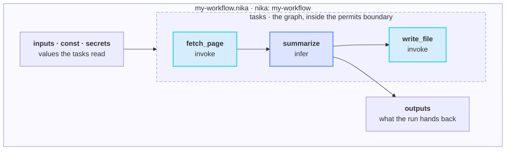
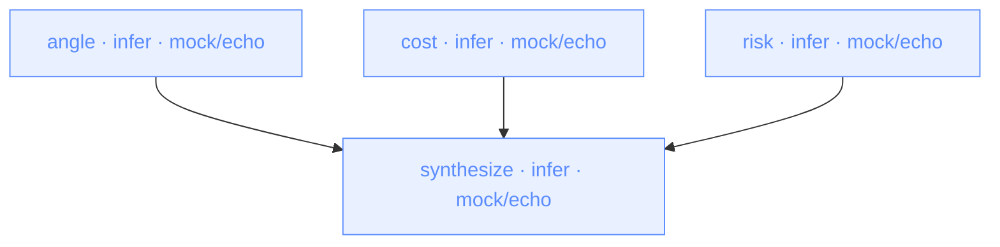
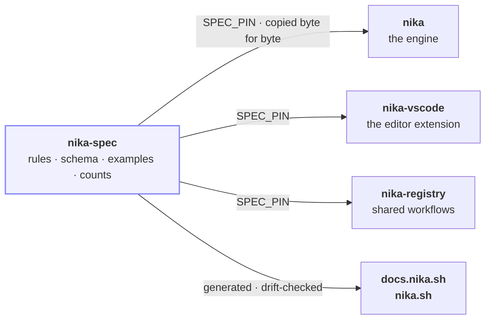

<p align="center">
  <a href="https://nika.sh">
    <picture>
      <source media="(prefers-color-scheme: dark)" srcset="https://nika.sh/brand/nika-logo-dark.svg">
      
    </picture>
  </a>
</p>

<h1 align="center">supernovae-st/nika-spec</h1>

<p align="center">
  <strong>Know exactly what a <code>.nika</code> workflow can say, check yours without an engine, and prove that an engine runs it right.</strong><br>
  The open specification of the Nika workflow language: its rules, JSON Schema, examples and conformance suite · Apache-2.0.
</p>

<p align="center">
  <a href="VERSION"></a>
  <a href="https://github.com/supernovae-st/nika-spec/actions/workflows/conformance.yml"></a>
  <a href="https://github.com/supernovae-st/nika/releases/latest"></a>
  <a href="https://docs.nika.sh"></a>
</p>

<p align="center">
  <a href="https://scorecard.dev/viewer/?uri=github.com/supernovae-st/nika-spec"></a>
  <a href="https://github.com/supernovae-st/nika-spec/actions/workflows/codeql.yml"></a>
  <a href="https://github.com/supernovae-st/nika-spec/actions/workflows/reuse.yml"></a>
  <a href="https://archive.softwareheritage.org/browse/origin/?origin_url=https://github.com/supernovae-st/nika-spec"></a>
  <a href="LICENSE"></a>
</p>

<!-- engine clips on this page (GIFs) are served from supernovae-st/nika main: they exist only there until the next engine release · at the next lockstep bump, pin them to that release tag -->
<p align="center"><b>Watch a workflow drawn as a graph, then lit up in the order it will run.</b></p>
<p align="center">
  <a href="https://raw.githubusercontent.com/supernovae-st/nika/main/media/gifs/dag-execution.optimized.gif">
    
  </a>
</p>
<p align="center"><sub>A workflow is a graph: <a href="examples/pr-review-fanout.nika"><code>examples/pr-review-fanout.nika</code></a>, drawn by <code>nika inspect</code>, planned by <code>nika check</code>. Notice the tasks that share a wave, and the review that fans out once per changed file. The graph and the waves are the commands' own output (nika 0.121.0); the lighting illustrates the plan.</sub></p>

## What is Nika?

Nika turns repeatable AI work into a small file you keep. Say what you
want done, like *"every Monday, pull the action items out of my meeting
notes"*, and Nika writes it as a readable `.nika` workflow. Before
anything runs, `nika check` shows what the workflow will do, which models
and tools it uses, what it is allowed to touch and what it can cost,
without calling a model. You run it when you decide, with the model you
choose, local or cloud, and every run leaves a tamper-evident record you
can verify. One Rust binary, local-first, open source (AGPL-3.0).

| 1 · Say it | 2 · Check it | 3 · Run it | 4 · Prove it |
|:---:|:---:|:---:|:---:|
| Describe the job; Nika writes a `.nika` file | `nika check` audits it before any model is called | `nika run` with the model you choose | `nika trace verify` checks the run's record |

> [!TIP]
> **This repository is the language itself.** It defines what every key and
> verb in a `.nika` file means, what `nika check` must catch and what a run
> must record, and it ships the tests that prove an engine agrees. The engine
> that runs your workflows is [nika](https://github.com/supernovae-st/nika);
> this specification is Apache-2.0, so anyone can build on it.

## Check a workflow in two minutes

You need `git` and Python 3. No engine, no API key, no model call.

1. **Get the spec and its checker.**

   ```sh
   git clone https://github.com/supernovae-st/nika-spec && cd nika-spec
   pip install -r conformance/requirements.txt
   ```

2. **Save the smallest complete workflow as `hello.nika`.**

   ```yaml
   nika: hello                 # its name, in kebab-case · never a version

   model: ollama/qwen3.5:4b    # a local model, no key · swap in any provider from the catalog

   permits: {}                 # nothing beyond the model: no files, hosts, shell or tools

   tasks:
     greet:                    # one task, one verb
       infer:
         prompt: "Say hello in French, in one short sentence."
         max_tokens: 2048

   outputs:
     greeting: ${{ tasks.greet.output }}   # what the run hands back
   ```

3. **Check it against the spec.** It is the same checker CI runs on the
   conformance tests, the examples and the templates here.

   ```sh
   python3 conformance/runner.py validate hello.nika
   ```

   ```json
   {
     "valid": true,
     "errors": []
   }
   ```

> [!NOTE]
> **Have the engine?** Install it with `brew install supernovae-st/tap/nika`
> and audit the same file. `nika check` is the static audit that runs before
> any model is called; `--model mock/echo` rehearses with no key and no
> network. The report ends with its verdict (nika 0.121.0):
>
> ```console
> $ nika check hello.nika --model mock/echo
> …
>  ✔ audited · 1 task · 1 wave · permits {} · est out ≤$0.0000 · 0 hints · risk low
>  layers · valid ✔ · access ready ✔ · capacity fit ✔ · run ready ✔
> ```

Run the whole suite exactly as CI does, with
`python3 conformance/runner.py all`: one `PASS` line per test, and a
non-zero exit if anything fails. Then let [QUICKSTART.md](QUICKSTART.md)
grow a real workflow in five minutes.

## What a `.nika` file is made of

A `.nika` file is plain YAML with nine top-level keys. Two are required,
`nika:` and `tasks:`. The others say what the tasks read, what they may
touch and what the run hands back, so a reviewer sees everything a workflow
can do in one file.

**Watch one file use all nine keys and every verb, labelled key by key.**

<p align="center">
  <a href="https://raw.githubusercontent.com/supernovae-st/nika/main/media/gifs/spec-anatomy.optimized.gif">
    
  </a>
</p>
<p align="center"><sub>Notice that every label is the spec's own wording, read from <code>nika spec</code>, and that each task binds exactly one verb. The verdict is the real <code>nika check</code> on that file (nika 0.121.0): run ready. The framing and the final fold are illustration.</sub></p>


```mermaid
flowchart LR
  subgraph file["my-workflow.nika · nika: my-workflow"]
    direction LR
    values["<b>inputs · const · secrets</b><br/>values the tasks read"]
    subgraph fence["tasks · the graph, inside the permits boundary"]
      direction LR
      fetch_page["<b>fetch_page</b><br/>invoke"]:::invoke --> summarize["<b>summarize</b><br/>infer"]:::infer --> write_file["<b>write_file</b><br/>invoke"]:::invoke
    end
    outputs["<b>outputs</b><br/>what the run hands back"]
    values --> fence
    summarize --> outputs
  end
  classDef infer fill:#5b8cff22,stroke:#5b8cff,stroke-width:2px
  classDef invoke fill:#22d3ee22,stroke:#22d3ee,stroke-width:2px
  style file fill:#8b8cf80d,stroke:#8b8cf8
  style fence fill:#8b8cf814,stroke:#8b8cf8,stroke-dasharray:6 4
```

| Key | Required | What it declares |
|---|:---:|---|
| `nika` | **yes** | The workflow's name, in kebab-case; tools save it as `<name>.nika`. No version is ever typed. |
| `model` | | The default model, as `<provider>/<name>`. Any task can override it. |
| `inputs` | | Typed values the caller passes at launch, read as `${{ inputs.<name> }}`. |
| `const` | | Fixed values baked into the file, read as `${{ const.<name> }}`. |
| `secrets` | | Where a secret lives (a vault, an environment variable or a file), never the value itself. Masked in logs and traces. |
| `permits` | | What the tasks may reach, run and read: hosts, paths, programs, tools. Leave it out and they may touch nothing. |
| `run` | | Where randomness and time come from. Seed it and use the virtual clock, and two runs record byte-identical traces. |
| `tasks` | **yes** | The work: a map of named tasks, each using one verb. The references between tasks draw the graph. |
| `outputs` | | What the workflow hands back when it finishes. |

The full rules for each key are in [spec/01-envelope.md](spec/01-envelope.md).

### The <!-- canon:verbs -->4<!-- /canon --> verbs

Each task does one thing, with one verb:

| Verb | What it does | In a file |
|---|---|---|
| `infer` | Asks a model once: text back, or an object that matches your `schema:` | `infer: { prompt: "Summarize ${{ inputs.text }}" }` |
| `exec` | Runs a program with its arguments, with no shell unless you ask for one | `exec: { command: ["cargo", "test", "--lib"] }` |
| `invoke` | Calls a tool: a builtin such as `nika:fetch`, an MCP tool, or another workflow | `invoke: { tool: "nika:fetch", args: { url: "https://example.com" } }` |
| `agent` | Lets a model work in a loop with only the tools you grant, up to `max_turns` | `agent: { prompt: "Review the diff", tools: ["nika:read", "nika:done"] }` |

> [!NOTE]
> Fetching a URL, writing a file or querying a database is not a verb of its
> own: it is a tool, reached with `invoke`. The list is closed on purpose, and
> [spec/02](spec/02-verbs.md#the-closure-argument--why-no-case-forces-a-5th-verb)
> shows why no case needs another one.

### Tasks form a graph

Tasks connect in two ways. A `with:` binding reads another task's result,
and that binding is the edge. An `after:` entry waits for a task without
reading its data. The engine builds the graph from those two alone, never
from the order you wrote the tasks in, and runs independent tasks side by
side, wave by wave, as the clip at the top shows. `when:` makes a task
conditional; `for_each:` fans it out over a list.

<details>
<summary><b>The DAG, drawn by nika itself</b> · paste the output of <code>nika inspect &lt;file&gt; --format mermaid</code> into any README</summary>

This is the untouched output of
`nika inspect examples/02-parallel-fanout.nika --format mermaid`
([the example](examples/02-parallel-fanout.nika)): three angles fan in to one
synthesis, and each verb keeps its color. GitHub renders it as is.


```mermaid
graph TD
  angle["angle · infer · mock/echo"]:::infer
  cost["cost · infer · mock/echo"]:::infer
  risk["risk · infer · mock/echo"]:::infer
  synthesize["synthesize · infer · mock/echo"]:::infer
  angle --> synthesize
  cost --> synthesize
  risk --> synthesize
  classDef infer fill:#5b8cff22,stroke:#5b8cff,color:#5b8cff
```

</details>

## What the rules give you

The spec does more than name keys: it tells an engine what to prove before
a run and what to record during one. Here is the reference engine doing it,
on captured output.

**Watch the check catch two mistakes before anything runs.**

<p align="center">
  <a href="https://raw.githubusercontent.com/supernovae-st/nika/main/media/gifs/static-check-fix.optimized.gif">
    
  </a>
</p>
<p align="center"><sub><b>Checked before it runs.</b> <code>nika check</code> audits the plan, permits, cost, secrets and types without calling a model (<a href="spec/07-conformance.md">spec/07</a>). Notice the misspelled task name it catches (<i>did you mean <code>assess</code>?</i>), the fix, and the re-check that ends <i>run ready</i>. The output is captured from the real CLI (nika 0.121.0) and the fix is a real diff.</sub></p>

Two more rules at work, each beside its chapter:

- **The file is the boundary.** `permits:` lists what a workflow may reach,
  run and read. Anything outside is refused
  ([spec/10](spec/10-authority.md)).
  ▶ [Watch the boundary catch an escape](https://raw.githubusercontent.com/supernovae-st/nika/main/media/gifs/permits-audit.optimized.gif)
- **Failure is part of the plan.** Errors carry stable codes.
  `on_error: recover` names the fallback; the trace records what failed
  ([spec/05](spec/05-errors.md)).
  ▶ [Watch a run recover when its live feed goes missing](https://raw.githubusercontent.com/supernovae-st/nika/main/media/gifs/on-error-recover.optimized.gif)

### The <!-- canon:pillars -->5<!-- /canon --> pillars · immutable forever

1. **Envelope** · `nika: <name>` and the nine keys above
2. **The <!-- canon:verbs -->4<!-- /canon --> verbs** · `infer` · `exec` · `invoke` · `agent`
3. **DAG shape** · tasks, `with:` data edges, `after:` control edges, `when`, `for_each`
4. **Variables** · one `${{ … }}` syntax over <!-- canon:namespaces -->5<!-- /canon --> namespaces: `inputs` · `const` · `secrets` · `with` · `tasks`
5. **Error model** · `NIKA-<NS>-<NNN>` codes, retry, structured output

As concepts, these five are locked for the life of the language; until the
reference engine reaches 1.0.0, their exact spellings can still change (see
[Status](#status)). Providers, builtins and extract modes live in the
[stdlib](stdlib/) and evolve on their own.

## Who this is for

| ✍️ You write workflows | 🛠️ You build an engine, an editor or a tool |
|---|---|
| **Learn by doing.** [QUICKSTART.md](QUICKSTART.md) grows a real workflow in five minutes; the numbered [examples](examples/README.md) take you further. | **Read the contract.** The [specification](spec/), starting with the one-page [overview](spec/00-overview.md). On a conflict, the prose wins over the schema and over every engine. |
| **Never start blank.** Copy a [template](templates/README.md); the [authoring guide](templates/AUTHORING.md) covers task boundaries and diagnostics. | **Use the machine-readable parts.** The [JSON Schema](schemas/workflow.schema.json) for structure, and [`canon.yaml`](canon.yaml) for the one list of verbs, builtins, providers and error codes. |
| **Catch mistakes as you type.** Point your editor at the [JSON Schema](spec/07-conformance.md#editor-tooling--the-canonical-json-schema) for autocomplete and inline errors. | **Prove it.** Run the [conformance suite](#for-implementers) and claim the level you pass. |
| **Let your coding agent write it.** It starts from [AGENTS.md](AGENTS.md) and [`llms.txt`](llms.txt). | **Give your agent the whole spec.** [`llms-full.txt`](llms-full.txt) holds every chapter in one file. |

## For implementers

Nika does not belong to one runtime. Any engine, in any language, can
implement it, and conformance is earned by passing the suite, never by
declaring it.

| Level | What your engine proves | Built for |
|---|---|---|
| **Core** | Parses and validates any workflow, builds the graph, resolves every reference, returns typed errors | Linters, editors, static analyzers |
| **Runtime** | Core, plus executing the verbs | A working engine with its own providers and tools |
| **Stdlib v0.1** | Runtime, plus the <!-- canon:providers -->17<!-- /canon --> providers, <!-- canon:extract_modes -->10<!-- /canon --> extract modes and <!-- canon:builtins -->28<!-- /canon --> builtins | A full engine, equivalent to the reference |

1. **Learn the words.** [GLOSSARY.md](GLOSSARY.md) gives each term one
   meaning (oracle, gate, golden…).
2. **Read the contract.** [spec/](spec/), chapter by chapter. The prose is
   normative: on a conflict it wins over the JSON Schema and over the
   reference engine, and the spec's own table owns the error codes.
3. **Run the suite.** The [runner protocol](conformance/runner-protocol.md)
   describes declarative tests (`input.yaml` + `expected.json`) that need
   only a YAML and a JSON parser. [`conformance/run.sh`](conformance/run.sh)
   `<your-engine>` drives the whole corpus through your binary and scores
   each file `PASS`, `DRIFT`, `BUG` or `DIVERGENT` against the intent its
   `# Expected:` header declares. Runtime claims add the behavioral
   differential: `NIKA_BIN=<engine> python3 scripts/runtime-differential.py`.
4. **Claim what you pass,** in the one public form:
   `Nika v1 Conformant — <Level> (spec <commit>)`
   ([spec/07 §Claiming](spec/07-conformance.md#claiming-conformance)).
5. **Get listed.** Open a pull request that adds your row to
   [CONFORMANT_IMPLEMENTATIONS.md](CONFORMANT_IMPLEMENTATIONS.md), with the
   spec commit and a command anyone can rerun.

> [!IMPORTANT]
> When an engine disagrees with the spec, the case stays in the suite,
> marked `DIVERGENCE`, and the disagreement is reported: visible pressure,
> never a silent pass.

<!-- motion: a conformance test declares its expected verdict in its `# Expected:` header, conformance/run.sh drives it through an engine, and the verdict comes back PASS -->

## Reference implementation

[supernovae-st/nika](https://github.com/supernovae-st/nika) is the reference
engine: one Rust binary, AGPL-3.0-or-later. Install it with
`brew install supernovae-st/tap/nika`, then check and run any workflow.

▶ [Watch it audit a meeting-notes workflow, then run it on a local model](https://raw.githubusercontent.com/supernovae-st/nika/main/media/gifs/nika-hero.optimized.gif)

- **The spec travels inside it.** The binary embeds this repository's
  chapters, schema and examples at the commit its `SPEC_PIN` names, so
  `nika spec --canon`, `nika spec --schema` and `nika try` work offline.
- **Editors and agents can ask it questions.** `nika mcp` serves a read-only
  MCP server with <!-- canon:mcp_tools -->9<!-- /canon --> tools
  (`nika_check` · `nika_explain` · `nika_schema` · `nika_examples` ·
  `nika_template` · `nika_canon` · `nika_catalog` · `nika_tools` ·
  `nika_inspect`). Running a workflow stays behind `nika run`.
- **Its score is public.** Its standing against the suite is a row in
  [CONFORMANT_IMPLEMENTATIONS.md](CONFORMANT_IMPLEMENTATIONS.md), earned by
  command at a pinned spec commit.
- **No engine at hand?** The [checker in this repository](conformance/)
  validates any workflow statically:
  `python3 conformance/runner.py validate <file>`.

## Why a language?

Today every AI tool keeps workflows in its own code: Python files,
TypeScript classes, prompts inline, graphs built step by step. None of it
travels. A language does:

- **One file, any conformant engine**, whether that engine is written in
  Rust, Python or Go.
- **Plain text.** Read, share, review and diff it like the rest of your code.
- **The language is the contract**; each runtime is an implementation.
- **Your choice of model.** The same file runs on local and open-weight
  models (Ollama, llama.cpp, vLLM), on Mistral, Hugging Face, OpenAI, xAI,
  Anthropic and the rest of a catalog of <!-- canon:providers -->17<!-- /canon -->
  providers; `mock/echo` rehearses with no key and no network.

Standards already work this way: SQL, GraphQL, OpenAPI, the Dockerfile,
GitHub Actions YAML. SQL is to PostgreSQL what Nika is to its reference
engine.

<details>
<summary><b>Why not GitHub Actions, Temporal, LangGraph, or just prompting an agent?</b></summary>

| Instead of | The one-line difference |
|---|---|
| **GitHub Actions / Argo** | CI YAML orchestrates repositories and runners. Nika's verbs are AI-native: `infer` is a first-class step with providers, budgets and structured output, not a shell step calling `curl`. |
| **Temporal / Inngest / Restate** | Those are durable-execution runtimes for long-lived distributed state. Nika is a language for finite, single-run graphs: no cluster, no event history, one file in, one run out. |
| **LangGraph / framework code** | A Python or TypeScript graph is code locked to its framework and runtime. A Nika file is portable text that any conformant engine runs, and there is deliberately no importer or exporter chaining it to another tool's semantics. |
| **Prompting an agent directly** | A workflow is reviewable, diffable, re-runnable and checked before any token is spent (`nika check`). A chat transcript is none of those. |

The full boundary, including what Nika deliberately does not do, is in
[spec/08-out-of-scope.md](spec/08-out-of-scope.md).

</details>

## The examples pack (versioned · embedded in the binary)

Every spec version ships a pack of canonical workflows: a numbered learning
path, and real jobs you can copy.

▶ [Watch `nika try` list the jobs this pack ships](https://raw.githubusercontent.com/supernovae-st/nika/main/media/gifs/workflow-gallery.optimized.gif)

- **Every example is a test.** CI validates each one as a conformance
  input, so an example that breaks the rules breaks the build.
- **The engine carries the pack of its version.** `nika try` rehearses these
  workflows offline, with the examples of the language version the binary
  speaks.
- **The docs and the website render these files**, never copies of them.
- **The pack is verifiable end to end.**
  [`examples/manifest.yaml`](examples/manifest.yaml) (generated; its
  `pack_version` is the [`VERSION`](VERSION) file) lists every workflow with
  its tier, the constructs it uses and a sha256 of its exact text, so a
  tampered or drifted example fails the check wherever it travels.

Learn from [examples/README.md](examples/README.md); copy a skeleton from
[templates/README.md](templates/README.md) instead of starting blank.

<a id="how-the-city-pins-the-law"></a>

## How every tool stays in sync

No tool reads this repository at a moving `main`. Each one names the exact
spec commit it was proven against, and a bot moves that pin forward by pull
request, so the tool's own checks judge every step.


```mermaid
flowchart LR
  spec["<b>nika-spec</b><br/>rules · schema · examples · counts"]
  engine["<b>nika</b><br/>the engine"]
  vscode["<b>nika-vscode</b><br/>the editor extension"]
  registry["<b>nika-registry</b><br/>shared workflows"]
  docs["<b>docs.nika.sh</b><br/><b>nika.sh</b>"]
  spec -- "SPEC_PIN · copied byte for byte" --> engine
  spec -- "SPEC_PIN" --> vscode
  spec -- "SPEC_PIN" --> registry
  spec -- "generated · drift-checked" --> docs
  style spec fill:#8b8cf822,stroke:#8b8cf8,stroke-width:2px
```

- **Every count has one home.** Verbs, builtins, providers, error codes and
  the rest live in [`canon.yaml`](canon.yaml), generated from the tables
  under [`canon/`](canon/). Prose does not retype those numbers: it carries
  a `<!-- canon:… -->` marker that `scripts/canon-projectors.py --check`
  rewrites or refuses.
- **Everything else is a checked projection.** [`SSOT.md`](SSOT.md) maps
  where each fact lives; [`estate.yaml`](estate.yaml) records where every
  file comes from, written by hand or generated with proof.

<details>
<summary><b>Who pins what</b>, and how to read a pin yourself</summary>

| Repository | Its pin | What the pin binds |
|---|---|---|
| [nika](https://github.com/supernovae-st/nika) (the engine) | `SPEC_PIN` at its root | `scripts/sync-pack.sh` copies `VERSION`, `QUICKSTART.md`, `canon.yaml`, the conformance coverage matrix, the design tokens, `spec/`, `schemas/`, `examples/`, `templates/` and the stdlib prose into `crates/nika-pack/pack/`, and writes `SPEC_SHA` beside them. CI copies again at the pin and fails on any byte of drift; the build refuses a `SPEC_PIN` and a `SPEC_SHA` that disagree. |
| [nika-vscode](https://github.com/supernovae-st/nika-vscode) | `SPEC_PIN` | its generated parts (verb starters, authoring shapes, design tokens) are projected from that commit, and a parity check judges them there |
| [nika-registry](https://github.com/supernovae-st/nika-registry) | `SPEC_PIN` | the first-party showcase entries are projected from that commit, so CI and a local run produce byte-identical entries |
| [nika-docs](https://github.com/supernovae-st/nika-docs) · [nika.sh](https://nika.sh) | this repository's generators | [`scripts/canon-projectors.py`](scripts/canon-projectors.py) and [`scripts/showcase-projector.py`](scripts/showcase-projector.py) render the counts and the examples as generated pages, checked with `--check`, never hand-copied |
| provenance | [`ESTATE_PIN`](ESTATE_PIN) here, and in the engine, the docs, the site and the registry | the shared provenance verifier is mirrored byte for byte from a published spec commit; the CI `mirror` job compares against exactly that commit |

An engine release names its spec commit twice, and the two must agree. For
example, at engine v0.118.7 (the last line runs in your clone of this
repository):

```sh
curl -sS https://raw.githubusercontent.com/supernovae-st/nika/v0.118.7/SPEC_PIN | grep -v '^#'
curl -sS https://raw.githubusercontent.com/supernovae-st/nika/v0.118.7/crates/nika-pack/pack/SPEC_SHA
git log -1 --format='%h %ad %s' --date=short 14bf49f435dc613da08187e4e4822948db267232
```

```
14bf49f435dc613da08187e4e4822948db267232
14bf49f435dc613da08187e4e4822948db267232
14bf49f 2026-09-05 fix(stdlib): define hash null and selector validation (#304)
```

</details>

## Repository layout

<details>
<summary>What lives where</summary>

```text
nika-spec/
├── spec/                      the specification, chapters 00 to 17
│   ├── 00-overview.md           the one-page vision: read this first
│   ├── 01-envelope.md           the top-level keys · nika · typed inputs, const, secrets
│   ├── 02-verbs.md              the verbs · signatures and semantics
│   ├── 03-dag.md                tasks · with/after edges · when · for_each
│   ├── 04-variables.md          ${{ }} and its namespaces
│   ├── 05-errors.md             error codes · retry · structured output
│   ├── 06-stdlib-contract.md    how the stdlib versions on its own
│   ├── 07-conformance.md        the levels · what « compliant » means · the claim form
│   ├── 08-out-of-scope.md       what Nika deliberately leaves out
│   └── 09 to 17                 types · authority · decision · gateway · outcomes · composition · proof · projections · trace
│
├── schemas/                   JSON Schemas for editors and tools
├── examples/                  the examples pack: the numbered path and the jobs
├── templates/                 skeletons to copy instead of starting blank
├── conformance/               the suite: tests, the checker (runner.py), the runner protocol
├── stdlib/                    providers, extract modes and builtins, versioned on their own
├── registry/                  how workflows are shared: entries, trust model, advisories
├── canon/ · canon.yaml        the source tables, and every count generated from them
├── governance/                how the spec evolves: the NEP process, the certifications matrix
├── adr/                       decision records for the language surface
├── reference/                 an executable model of the scheduling core
├── eval/                      the agent-authoring benchmark
├── timeline/                  every dated claim, re-proven weekly against its source
├── scripts/                   generators and checks that keep docs, site and pack in sync
├── tools/estate/              the public provenance verifier
├── GLOSSARY.md                one word, one meaning
├── AGENTS.md                  the authoring protocol coding agents start from
└── llms.txt · llms-full.txt   the spec for AI agents: an index, and every chapter in one file
```

</details>

## Contributing

- **Fixes and teaching.** Errata, typos, clearer wording, new tests for
  behavior the spec already defines, tooling under `scripts/`: open a pull
  request.
- **Changing the language.** Anything that changes the language surface,
  the stdlib contract, what the suite means or the trace formats is a pull
  request against [`spec/`](spec/) that lands with its conformance tests.
  At the v1 pre-freeze this becomes a NEP, a Nika Enhancement Proposal
  ([NEP-0000](governance/nep-0000-the-nep-process.md)), for everyone,
  maintainers included.
- **The bar.** CI runs `python3 conformance/runner.py all`, the selftests
  and every generated-file check. Sign off each commit (`git commit -s`,
  the [DCO](https://developercertificate.org)). If you touch `README.md` or
  `spec/*.md`, rerun `python3 scripts/llms-projector.py --write`.

Not sure an idea deserves a proposal? Pressure-test it first in the engine's
[Ideas discussions](https://github.com/supernovae-st/nika/discussions/categories/ideas).
[CONTRIBUTING.md](CONTRIBUTING.md) has the full bar.

<details>
<summary><b>The tooling</b> that keeps generated files honest</summary>

| Tool | What it does |
|---|---|
| [`canon.yaml`](canon.yaml) | the one source for every language count: verbs, namespaces, builtins, providers, extract modes, error namespaces |
| [`scripts/canon-projectors.py`](scripts/canon-projectors.py) | writes those counts into the markers in this repository, the docs and the website (`--write` / `--check`) |
| [`scripts/showcase-projector.py`](scripts/showcase-projector.py) | turns the [`examples/`](examples/) jobs into the docs' example pages and the website's explorer |
| [`conformance/runner.py`](conformance/runner.py) | the static checker: core, stdlib and deep tests, plus every example as a conformance input (the CI gate) |
| [`conformance/run.sh`](conformance/run.sh) | the engine-side runner: `PASS` · `DRIFT` · `BUG` · `DIVERGENT` per file, against its declared intent |
| [`.pre-commit-hooks.yaml`](.pre-commit-hooks.yaml) | pre-commit hooks for repositories that consume this spec (`nika-check` · `nika-check-strict`) |

</details>

## Status

- **A draft on its way to v0.1.0 GA.** The spec's version is in
  [`VERSION`](VERSION); the spec badge above reads it live. GA follows the
  spec review, the examples, the conformance suite and the schemas; it is
  gated on readiness, not on a date.
- **Checked today.** The chapters, [`workflow.schema.json`](schemas/workflow.schema.json),
  the static tests (core, deep, stdlib surface and the value-authority
  lanes) and every example run in CI; `python3 conformance/runner.py all`
  prints the live count. Runtime behavior is measured by command against
  the engine; the stdlib's network half (fetch under HTTP mocks, providers
  beyond `mock/echo`) is still pending
  ([spec/07 §Suite status](spec/07-conformance.md#suite-status--v01-honest)).
- **Stable where it counts.** The language family is v1, forever: there is
  no `nika: v2`. Until the reference engine ships 1.0.0, breaking changes
  land inside v1; from engine 1.0.0 on, the language only grows, additively.
  The engine versions separately.
- **History you can check.** Every dated claim about the language is
  re-proven weekly in CI against its source
  ([`timeline/timeline.yaml`](timeline/timeline.yaml), git tags, the GitHub
  and crates.io APIs) and shown with the next milestones at
  [nika.sh/timeline](https://nika.sh/timeline).

## Governance

- **Editor:** SuperNovae Studio (Thibaut Melen and Nicolas).
- **How it evolves:** until the v1 pre-freeze, a pull request against
  [`spec/`](spec/) with its tests. The NEP process
  ([NEP-0000](governance/nep-0000-the-nep-process.md) ·
  [template](governance/nep-template.md)) is built and dormant; it becomes
  binding at the freeze.
- **Where it is discussed:** in the proposal's public pull request. There is
  no private track.
- **Decisions:** accepted and rejected NEPs both stay published in
  [governance/](governance/), summarized in [CHANGELOG.md](CHANGELOG.md).
- **Handing over:** when three to five independent vendors ship conformant
  runtimes, authority moves to a technical committee they seat together, by
  NEP, through the same process.
- **Posture:** the badges this repository earns from outside verifiers
  (Scorecard, CodeQL, REUSE, SchemaStore, CITATION.cff), and those it does
  not claim yet, are listed with their evidence in
  [governance/certifications.md](governance/certifications.md).

<!-- city:map -->
## 🦋 The Nika family

| | Repository | What it gives you |
|---|---|---|
| 🦋 | [nika](https://github.com/supernovae-st/nika) | The engine and CLI: write, check, run and verify AI workflows |
| 📖 | [nika-docs](https://github.com/supernovae-st/nika-docs) | The documentation, live at [docs.nika.sh](https://docs.nika.sh) |
| 📜 | **[nika-spec](https://github.com/supernovae-st/nika-spec)** | **The language specification and the suite that proves an engine follows it** |
| 🧩 | [nika-vscode](https://github.com/supernovae-st/nika-vscode) | The editor extension: your workflow as a live graph, errors as you type |
| 🟦 | [nika-client](https://github.com/supernovae-st/nika-client) | Run and verify workflows from TypeScript |
| ✅ | [nika-action](https://github.com/supernovae-st/nika-action) | A GitHub Action that posts a `nika check` verdict on your pull requests |
| 🚀 | [nika-actions-starter](https://github.com/supernovae-st/nika-actions-starter) | A ready template: workflows, editor setup and CI from the first push |
| 📦 | [nika-registry](https://github.com/supernovae-st/nika-registry) | Shareable workflows, pinned and re-verified |
| 🤖 | [nika-plugins](https://github.com/supernovae-st/nika-plugins) | Teaches your coding agent (Claude Code, Codex, Cursor…) to write Nika |
| 🍺 | [homebrew-tap](https://github.com/supernovae-st/homebrew-tap) | `brew install supernovae-st/tap/nika` |
| 🐙 | [gh-nika](https://github.com/supernovae-st/gh-nika) | The Nika CLI as a GitHub CLI extension |
| 🏛️ | [nika-estate](https://github.com/supernovae-st/nika-estate) | Where each file in Nika's core repositories comes from, declared and re-checkable |
<!-- /city:map -->

## Related

- **Every way to use Nika, on one page:** install paths, editors, agents,
  skills, MCP, CI and SDKs, at
  [docs.nika.sh/integrations/everywhere](https://docs.nika.sh/integrations/everywhere)
- **[nika.sh](https://nika.sh):** the website, with
  [templates](https://nika.sh/templates), the
  [timeline](https://nika.sh/timeline) and the living
  [map of the ecosystem](https://nika.sh/map)
- **From TypeScript:** [nika-client](https://github.com/supernovae-st/nika-client)
  is published on npm as `@supernovae-st/nika`

## Security

Please report vulnerabilities privately, never in a public issue: use
**Report a vulnerability** under this repository's Security tab, or email
security@supernovae.studio. You get an acknowledgement within 72 hours;
[SECURITY.md](SECURITY.md) has the full process.

## License

The specification, its examples, its conformance tests and its JSON Schemas
are licensed **Apache-2.0**, with its patent grant: use them freely
([LICENSE](LICENSE)). The reference engine, in its own repository, is
AGPL-3.0-or-later.

[Security policy](SECURITY.md) · [Contributing](CONTRIBUTING.md) ·
[Code of conduct](CODE_OF_CONDUCT.md) · [Docs](https://docs.nika.sh)

---

<p align="center">🦋 <i>Quality over speed · less but better · Rams principle 10.</i></p>
